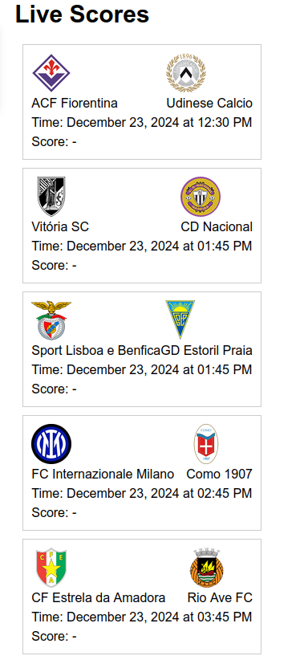

# Turf Stats Logger 🎯⚽

Turf Stats Logger is a platform where users can log in their G/A (goals + assists), positions played, injuries etc to keep a track of them, as well as visualize their performances over time through graphs. They can also look at grounds nearby, and be updated with the latest scores of prominent matches happening around the world. The platform also lets people send and receive friend requests, through which they can look at their friends' performances as well. Signing up to the platform is as simple as it can be, by directly using Google's authentication, therefore no need for remembering usernames and passwords.

## Table of Contents
- [Overview](#overview)
- [Features](#features)
  - [Authentication](#-authentication)
  - [Stats Tracking](#-stats-tracking)
  - [Social Features](#-social-features)
  - [Venue Discovery](#️-venue-discovery)
  - [Live Scores](#-live-scores)
- [Tech Stack](#tech-stack)
- [Getting Started](#getting-started)
  - [Prerequisites](#prerequisites)
  - [Installation](#installation)
  - [Environment Variables](#environment-variables)

## Overview
The purpose and drive behind this project was that for a long time, I have always wanted to build something that is close to my interests and passions, with my skills for software development. After some months into my internship, I decided that this was the right time, and I was confident enough to start building something integrating my software and football interests. As I spend a lot of time on twitter, instagram, reddit etc going through football forums, statistics has been a very big part of discussions amongst friends, and I thought, wouldn't it be cool if instead of just looking at some other player's stats, we could track our own, and discuss and compare our own performances instead. The thought behind the project was to solely build a personal end-to-end project where I try to do all the work by myself (ideation, frontend, backend, hosting, documentation etc) as a learning process.

## Features

### 🔐 Authentication
- One-click Google OAuth login
- Secure and hassle-free authentication

### 📊 Stats Tracking
- Log goals, assists, and positions played
- Track injuries and recovery
- Visualize performance trends

### 🤝 Social Features
- Connect with other players
- Compare stats with friends
- Share achievements

### 🗺️ Venue Discovery
- Find nearby football grounds
- Get directions and facility details

### ⚽ Live Scores
- Real-time match updates
- Major league coverage

## Tech Stack
- **Frontend**: React, Tailwind CSS
- **Backend**: Python FastAPI
- **Database**: MongoDB
- **APIs**: Google Places, football-data.org

## Getting Started

### Prerequisites
- Node.js (v14+)
- Python (v3.8+)
- MongoDB Atlas account

There are very little dependencies apart from those mentioned above. The setup is therefore pretty straightforward

Frontend:
`npm install`
`npm start`

Backend:
Create a virtual environment
`pip install -r requirements.txt`
`uvicorn app.main:app --reload`

Apart from that, there are a few secret keys that were used for this project for the:
- MongoDB atlas database
- Google Places API
- Google OAuth
- football-data.org (for fetching the live scores)